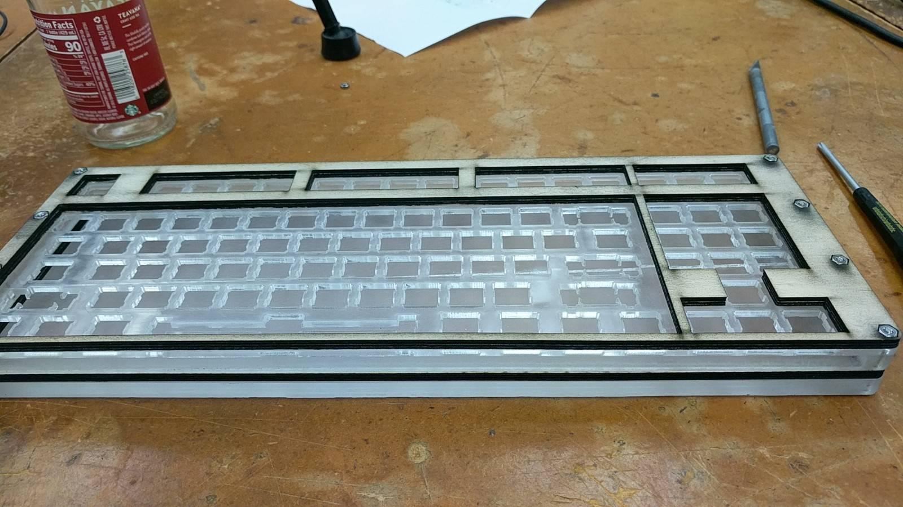
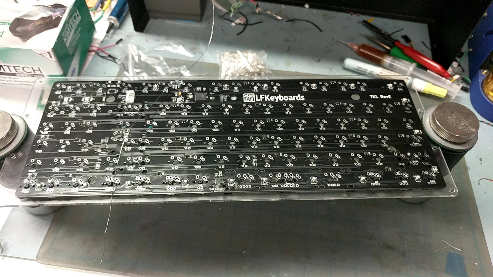
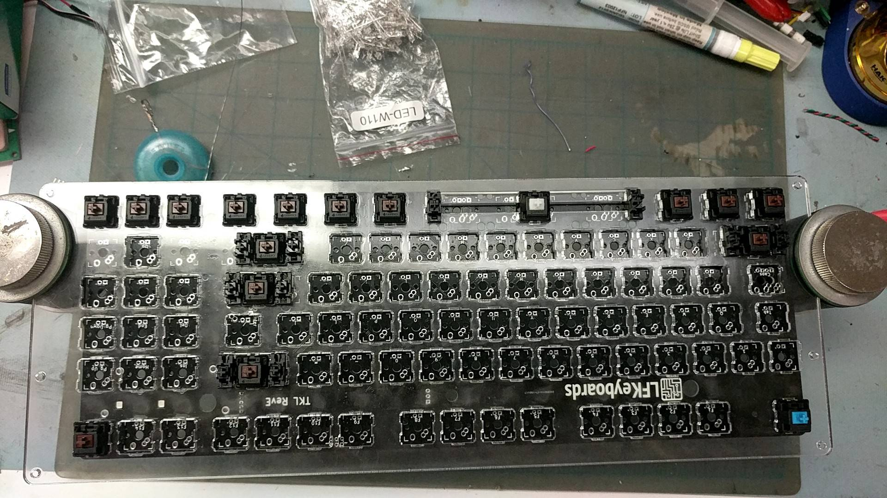
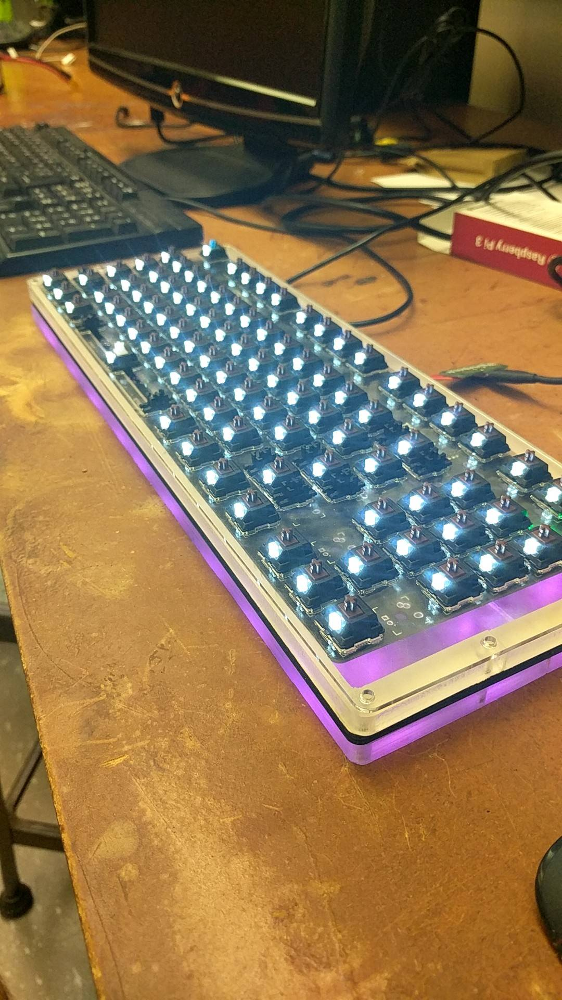
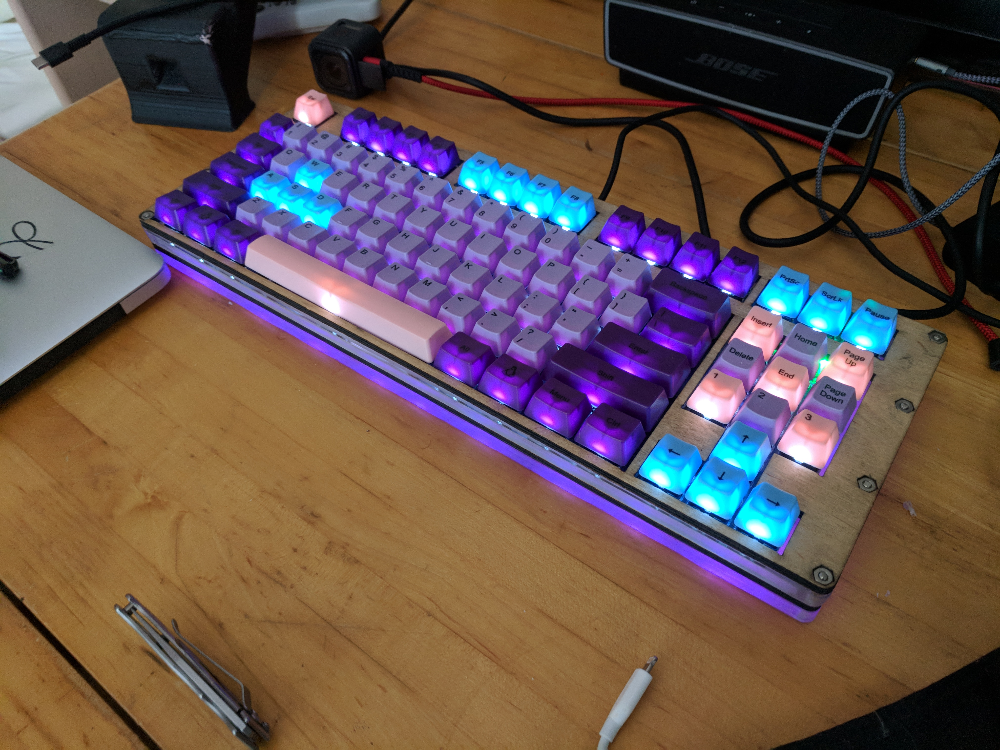

Original idea was spawned when going through the scrap bin in the laser cutting room. I found a slab of quarter inch thick acrylic and had a dream to be able to have a keyboard that, instead of the normal RGB under the keys, had an underglow. I got to work designing a keyboard that would fit inside the size acrylic I had and I settled onto 10 keyless design that I could laser cut out of a combination of birch wood and the acrylic.

# The Case
Designed in Fusion360, the case was designed with the dimensions of the acrylic in mind. The walls are reletively thin for a keyboard but the height is much greater then most standard keyboards. Because of the thickness of the acrylic and the undesigned PCB depth, this ended up being too large of a safety margin, however, it does make the underglow look very good. 

# The PCB
After assembling the case I had the PCB printed with the help of LFKeyboards.

# Soldering
Then I selected the keys that I wanted and began to hand solder the PCB including all 107 keys. Each key was 5 solder joints, each LED in each of the keys was 2 and thats not even counting the numerous other components soldered to the back of the keyboard. In total there were more then 1000 solder joints done by hand over a 7 hours period. I did it straight only stopping for 15 minutes to eat in the middle. This, is unadvisable. Despite eye protection and vent use, I developed a [smokers ptergyeum](https://www.healthline.com/health/pterygium#causes), a growth on my eye, caused by the prolonged exposure to burning flux. 

# Testing
After installing the frimware, [QMK](https://qmk.fm/), the keyboard was ready to be tested. Each key had to be individually tested to ensure the controller and the other hardware was working. After that was done, I could move on to testing each LED and ensure that the RGB underglow was working. 

# Final Product
After confiming all the keys work and the backlight and underglow work I was able to install the keycaps and call it complete. This project was an intense crash course in soldering. I recomend to anynone who is interested in learning to solder to pursue a project that provides the repetition required to learn soldering.  

